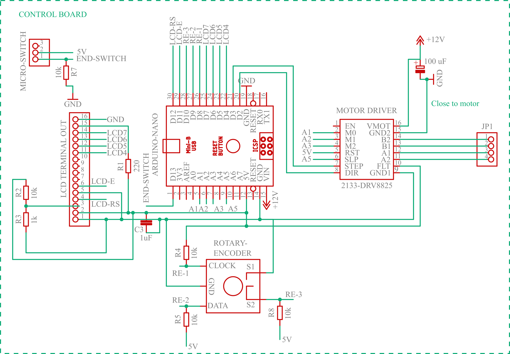
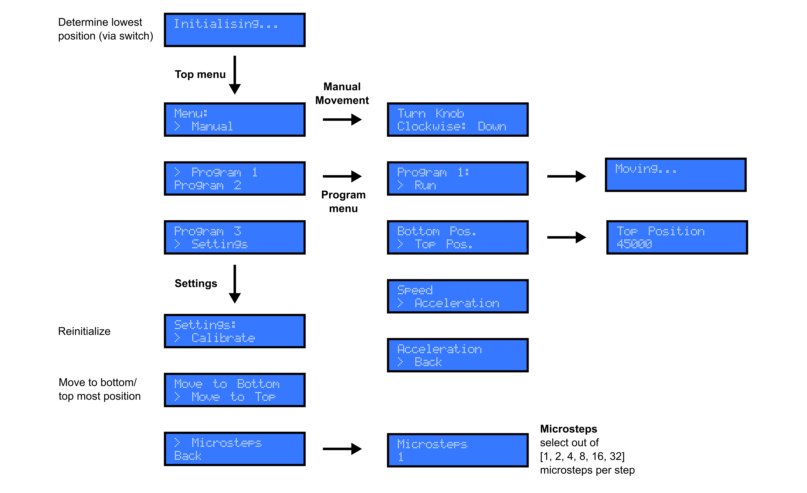

# Open-source Dip Coater Control

This repository tracks the control software for an open-source dip coater
described in <DOI>. The software has to be flashed on an Arduino (Arduino Nano
in this work).

## Electronic Schematics

## User Journey

## Development

Please report bugs or file pull requests to share your experience with the
device.
